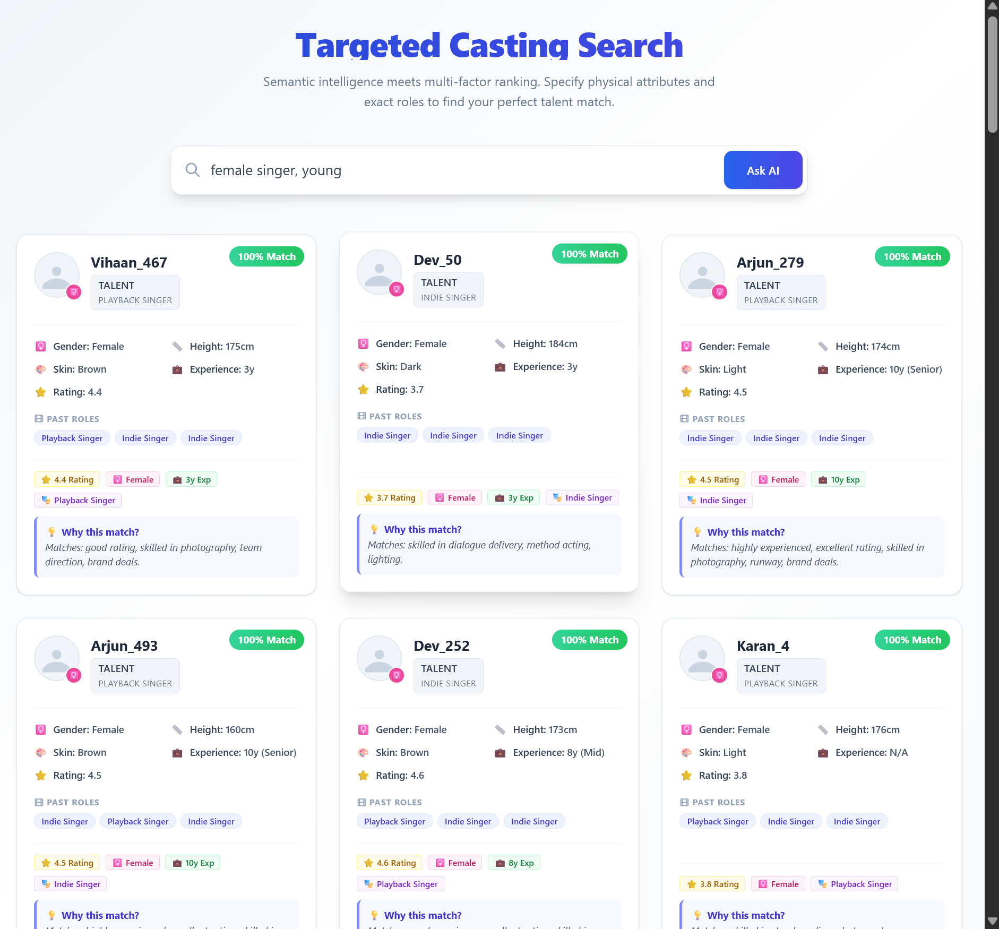
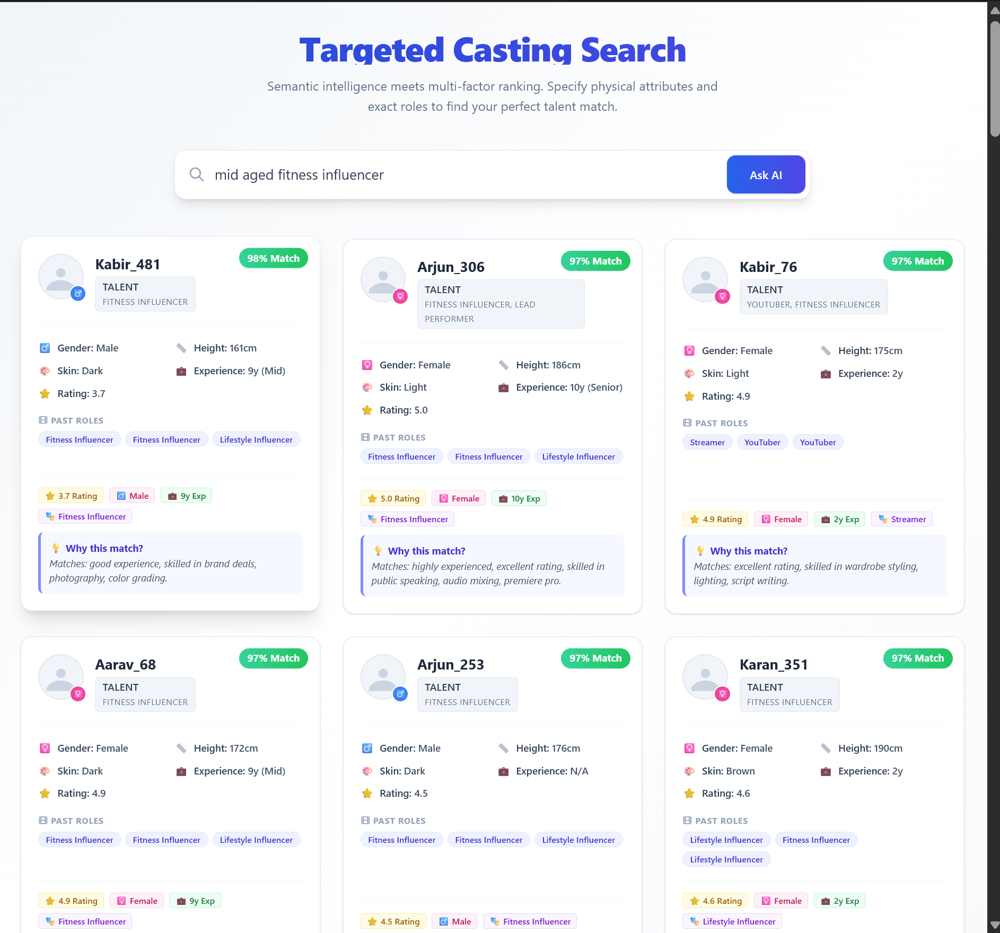
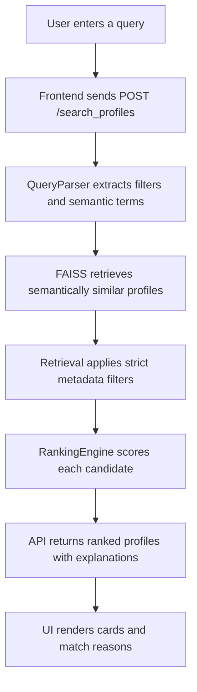

# Targeted Casting Search

AI-powered talent discovery for casting teams. The app lets a user type natural language queries such as `female singer, young`, `mid aged fitness influencer`, or `male villain brown 6 feet`, then returns ranked talent profiles with match scores and explanations.





## Features

- Natural language talent search for roles, crafts, physical attributes, rating, age, and experience.
- Strict metadata filtering for gender, height, complexion, craft, and other structured fields.
- Semantic search over enriched profile descriptions using sentence-transformer embeddings.
- FAISS vector index for fast local retrieval.
- Multi-factor ranking based on semantic similarity, role relevance, experience, rating, and profile metadata.
- Explainable results with a "Why this match?" reason on every card.
- FastAPI backend with a vanilla HTML, CSS, and JavaScript frontend.
- Optional AI parsing through Azure OpenAI and optional local assistant behavior through Ollama.

## Tech Stack

| Layer | Technology |
| --- | --- |
| Backend API | FastAPI, Uvicorn |
| Frontend | HTML, CSS, JavaScript |
| Data validation | Pydantic |
| Query parsing | Rule-based parser plus Azure OpenAI extraction |
| Embeddings | HuggingFace `sentence-transformers/all-MiniLM-L6-v2` |
| Vector search | FAISS via `langchain-community` |
| AI orchestration | LangChain, LangGraph |
| Local LLM support | Ollama, Llama 3 |
| Environment config | `python-dotenv` |
| Document utilities | `pypdf`, `docx2txt` |

## Project Structure

```text
Document Assistant/
  app/
    main.py                 # FastAPI entrypoint and static file mounting
    talent_api.py           # REST API endpoints
    query_parser.py         # Natural language parsing and filters
    retrieval.py            # Hybrid retrieval pipeline
    ranking.py              # Multi-factor ranking and explanations
    embeddings_pipeline.py  # Document creation, embeddings, FAISS index
    data_pipeline.py        # Raw profile normalization and enrichment
    talent_agent.py         # Chat/agent helper logic
    config.py               # Paths, model names, scoring weights
  data/
    1500_profiles.json      # Raw source profiles
    processed_profiles.json # Normalized and enriched profiles
  faiss_index/              # Saved FAISS vector index
  static/
    index.html              # UI
    style.css               # UI styling
    app.js                  # Browser search logic
  docs/assets/              # README screenshots
  requirements.txt
  .env.example
```

## Prerequisites

- Python 3.10 or newer. Python 3.11 is recommended if a dependency has trouble installing on newer versions.
- Git.
- At least 4 GB RAM for the sample dataset. 8 GB or more is better for rebuilding embeddings.
- Optional: Ollama if you want local chat/agent behavior.
- Optional but recommended: Azure OpenAI credentials for structured query extraction.

## Environment Variables

Create a `.env` file in the project root. Do not commit real keys to GitHub.

```env
# Azure OpenAI query parser
AZURE_OPENAI_ENDPOINT=https://your-resource-name.openai.azure.com/
AZURE_OPENAI_API_KEY=your_azure_openai_key
AZURE_OPENAI_API_VERSION=2024-12-01-preview
AZURE_OPENAI_MODEL_NAME=gpt-5-mini

# Ollama local LLM settings
OLLAMA_BASE_URL=http://localhost:11434
OLLAMA_MODEL=llama3
```

Notes:

- `AZURE_OPENAI_ENDPOINT` should be the base resource URL, not the full chat completions URL.
- `AZURE_OPENAI_MODEL_NAME` should match your Azure deployment name.
- If Azure OpenAI is unavailable, the app falls back to local rule-based parsing for important filters such as gender.
- If you use Ollama, install it from `https://ollama.com` and pull the model with `ollama pull llama3`.

## Setup From Scratch

### 1. Clone the repository

```bash
git clone <your-repo-url>
cd "Document Assistant"
```

### 2. Create and activate a virtual environment

Windows PowerShell:

```powershell
python -m venv venv
.\venv\Scripts\Activate.ps1
```

macOS/Linux:

```bash
python -m venv venv
source venv/bin/activate
```

### 3. Install dependencies

```bash
python -m pip install --upgrade pip
pip install -r requirements.txt
```

### 4. Add environment keys

Copy the sample file and add your values:

Windows:

```powershell
Copy-Item .env.example .env
notepad .env
```

macOS/Linux:

```bash
cp .env.example .env
nano .env
```

Add the Azure OpenAI variables shown above if you want cloud query parsing.

### 5. Prepare profile data

Place the source dataset at:

```text
data/1500_profiles.json
```

The repository already contains sample data. If you replace it, keep the profile structure compatible with the schema below.

### 6. Process profiles

Run the setup script to normalize and enrich the raw data:

```bash
python setup_talent_search.py --process
```

This creates:

```text
data/processed_profiles.json
```

### 7. Build the vector index

```bash
python setup_talent_search.py --index
```

This creates or updates:

```text
faiss_index/
```

To rebuild from scratch:

```bash
python setup_talent_search.py --index --force
```

### 8. Run the backend server

```bash
python -m uvicorn app.main:app --host 127.0.0.1 --port 8000 --reload
```

Open the UI:

```text
http://127.0.0.1:8000/ui
```

Open the API docs:

```text
http://127.0.0.1:8000/docs
```

## Quick Health Check

After starting the server:

```bash
curl http://127.0.0.1:8000/health
```

Expected result:

```json
{
  "status": "ok",
  "search_engine_ready": true,
  "data_processed": true,
  "source_data_exists": true
}
```

## How Search Works



Example query:

```text
female singer, young
```

The parser identifies:

```json
{
  "filters": {
    "gender": "female"
  },
  "semantic_query": "female singer young",
  "target_gender": "female"
}
```

The retrieval layer removes profiles where `metadata.gender` is not `female`. Ranking then sorts the remaining profiles by relevance.

## Ranking Logic

The ranking engine combines multiple signals:

- Semantic similarity from the embedding search.
- Gender match, with strict removal for mismatches.
- Role and craft matches from past roles, subcrafts, casting tags, and craft.
- Age range match when age is requested.
- Rating threshold when rating is requested.
- Experience and rating signals for better explanations.

The UI displays:

- Match percentage.
- Name and craft.
- Gender, height, skin tone, experience, rating, and age when available.
- Past roles.
- Explanation text under "Why this match?"

## Profile Structure

Each processed profile should follow this structure:

```json
{
  "id": "user_0001",
  "name": "Vihaan_1",
  "age": 25,
  "gender": "male",
  "height_info": {
    "height_cm": 177,
    "height_bucket": "medium"
  },
  "complexion_standard": "light",
  "craft": "actor",
  "skills": [
    "voice modulation",
    "method acting",
    "lighting"
  ],
  "experience_years": 4,
  "rating": {
    "average": 3.6,
    "reviews_count": 24
  },
  "creator_metrics": {
    "followers": 188176,
    "engagement_rate": 5.72,
    "platforms": ["Instagram"]
  },
  "appearance_tags": ["fit", "modern"],
  "past_roles": [
    "Lifestyle Influencer",
    "Fitness Influencer"
  ],
  "subcrafts": [
    "Fitness Influencer",
    "Dubbing Artist"
  ],
  "semantic_profile": "Rich descriptive profile used for semantic search.",
  "casting_tags": [
    "villain",
    "hero",
    "comic",
    "supporting"
  ],
  "personality_tags": [
    "intense",
    "dominant",
    "charismatic"
  ],
  "appearance_tags_enhanced": [
    "fit",
    "modern",
    "lean"
  ]
}
```

Important fields:

| Field | Purpose |
| --- | --- |
| `id` | Stable unique profile identifier |
| `name` | Display name shown in result cards |
| `age` | Used for age filtering |
| `gender` | Strict filter. Expected values: `male`, `female` |
| `height_info.height_cm` | Exact height displayed in the UI |
| `height_info.height_bucket` | Search bucket such as `short`, `medium`, `tall` |
| `complexion_standard` | Normalized skin tone such as `light`, `brown`, `dark` |
| `craft` | Primary talent category |
| `skills` | Used for display and explanation |
| `experience_years` | Used for ranking and display |
| `rating.average` | Used for ranking and display |
| `past_roles` | Used for role matching and badges |
| `subcrafts` | Secondary craft categories |
| `semantic_profile` | Main text embedded into the FAISS index |
| `casting_tags` | Role tags used for ranking |
| `personality_tags` | Personality match signals |

## API Endpoints

| Method | Endpoint | Description |
| --- | --- | --- |
| `GET` | `/` | API information |
| `GET` | `/ui` | Frontend application |
| `GET` | `/health` | Health and index status |
| `GET` | `/stats` | Search engine stats |
| `POST` | `/search_profiles` | Natural language profile search |
| `POST` | `/similar_profiles` | Find profiles similar to a profile ID |
| `POST` | `/filter_profiles` | Structured filter search |
| `GET` | `/profile/{profile_id}` | Fetch one profile |
| `POST` | `/chat` | Chat assistant endpoint |
| `POST` | `/process_data` | Process raw profile data |
| `POST` | `/build_index` | Build the FAISS search index |
| `DELETE` | `/clear_index` | Remove processed data and vector index |
| `GET` | `/query_explain` | Explain parsed query filters |
| `GET` | `/casting_suggestions` | Example queries and tips |

## Example API Calls

Search profiles:

```bash
curl -X POST http://127.0.0.1:8000/search_profiles \
  -H "Content-Type: application/json" \
  -d "{\"query\":\"female singer young\",\"max_results\":10,\"enable_reranking\":true}"
```

Find similar profiles:

```bash
curl -X POST http://127.0.0.1:8000/similar_profiles \
  -H "Content-Type: application/json" \
  -d "{\"profile_id\":\"user_0001\",\"max_results\":5}"
```

Filter profiles:

```bash
curl -X POST http://127.0.0.1:8000/filter_profiles \
  -H "Content-Type: application/json" \
  -d "{\"filters\":{\"gender\":\"female\",\"craft\":\"model\"},\"max_results\":20}"
```

Explain query parsing:

```bash
curl "http://127.0.0.1:8000/query_explain?query=female%20singer%20young"
```

## Common Queries

```text
female singer young
male villain brown 6 feet intense actor
mid aged fitness influencer
tall female model with good rating
male stand-up comedian
young female lead romantic role
experienced male antagonist dark complexion
```

## Troubleshooting

### Server starts but search returns no results

Check health:

```bash
curl http://127.0.0.1:8000/health
```

If `search_engine_ready` is false, rebuild the index:

```bash
python setup_talent_search.py --process
python setup_talent_search.py --index --force
```

### Dependency install fails

Use Python 3.11 and reinstall:

```bash
python -m venv venv
.\venv\Scripts\Activate.ps1
python -m pip install --upgrade pip
pip install -r requirements.txt
```

### Azure parsing fails

Confirm these values in `.env`:

```env
AZURE_OPENAI_ENDPOINT=https://your-resource-name.openai.azure.com/
AZURE_OPENAI_API_KEY=your_key
AZURE_OPENAI_API_VERSION=2024-12-01-preview
AZURE_OPENAI_MODEL_NAME=your_deployment_name
```

The app can still use local parsing for basic filters if Azure is unavailable.

### Port 8000 is already in use

Run on another port:

```bash
python -m uvicorn app.main:app --host 127.0.0.1 --port 8001 --reload
```

Then open:

```text
http://127.0.0.1:8001/ui
```

## Development Notes

- Keep `.env` out of version control.
- Do not commit real API keys.
- Rebuild `faiss_index/` after changing the processed profile data.
- Re-run processing after changing normalization or enrichment logic.
- The frontend calls relative API paths, so it works from the same FastAPI server without changing `static/app.js`.

## License

MIT License.
